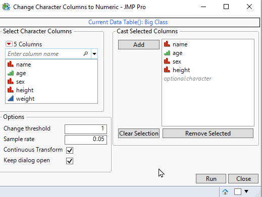

# Character Columns to Numeric

| [Description](#description) | [Usage](#usage) | [Execution](#execution) | [Possible future features](#possible-future-features) |

## Description 
Sometimes data is coded wrong and number columns have character data type. This tool will loop over selected columns and determine if the datatype of column could be changed to numeric. This check is done by trying to change "random" values in the column to numeric and if enough changes succeed (threshold) the column data type will be changed. There is also an option to attempt to change columns from character to numeric. This will include check if the changed values can be divided by 1 without leaving reminders, Modulo(x, 1).

## Usage

The tool window is not *<<modal*, so user is able to check out the datatable they are currently analysing. The table can also be brought to front by pressing the blue table name in top of tool.

Tool consists of four different parts:
 1. Filter column selector which shows only character columns in the table
 2. Options selections
 3. Column list to analyse
 4. Run and Cancel buttons

When the tool is run, tool will pre-fill columns based on two rules:
 1. Fill selected columns
 2. If no columns are selected, fill all columns in the table
 3. (User can add new colums for analysis by drag-and-drop or by pressing Add button when columns are selected in Filter Col Selector)

### User-interface



### Options
User has access to following options directly from the user interface:
| Option               | Purpose                                                                                  | Values |
| -------------------- | ---------------------------------------------------------------------------------------- | ------ |
| Change Threshold     | Can be used to give threshold point, at which the value can be changed                   | [0,1]  |
| Sample Rate          | Sample rate which will be used when there are over 10000 unique values in column         | (0,1]  |
| Continuous Transform | Enable to make tool to check for possible continuous values (values which have decimals) | 0,1    |
| Keep Dialog Open     | Enable to leave tool window open after pressing Run button                               | 0,1    |


## Execution

After user presses Run button the script will start doing the analysis. Columns will be looped over one by one and if changes are done, they are printed to log:
```javascript
res = "Changed column age to Numeric.";
res = "Changed column height to Numeric.";
```
Tool will also open ProgressBar during execution with Cancel-button, so user is able to see approximation how long the execution will take and cancel if needed (execution is usually so fast that progress bar wont be seen).

### Running without GUI
Tool can also be run without GUI. This can be done by modifying *settings.json's* **use_gui** value to 0. In this case the tool will perform analysis on selected columns OR all columns if none are selected. The default values which will be used for **sample_rate** and **threshold** will be taken from *settings.json*

## Possible future features
 * Add possibility to change between different datatables (annoying to due to how filter col selecter and col list box has to be done)
 * Add possibility to user change what is returned after script has analyzed column
 * Add possibility to print script to log / source table
 * Create Custom Function of `change_character_column_to_numeric(ol_name, <dt = Current Data Table()>, <sample_rate = 1>, <change_threshold = 1>, <allow_int = 0>)`
 * Add to JMP's Toolbar