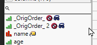

# Create Order Column
| [Description](#description) | [Usage and Execution](#usage-and-execution) | [Possible future features](#possible-future-features) |

## Description 

This tool will create Ordering column to datatable with current row numbers. This is useful when you are starting analysis and want to sort the data, but still have possibility to roll-back to original order. The column will be created in the start of datatable and if multiple ordering columns are created, indexing is added.

## Usage and Execution
When user executes the tool, it will create new column to current datatable. The name of column and it's properties can be managed in *settings.json*.

### Two index columns created as hidden and excluded

### Options
User has access to following options directly from the user interface:

| Option         | Description                                            | Values |
| -------------- | ------------------------------------------------------ | ------ |
| hide_column    | If enabled will set the ordering column as hidden      | 0,1    |
| exclude_column | If enabled will set the ordering column as excluded    | 0,1    |
| order_col_name | String which will be used to name the ordering columns | String |

## Possible future features
 * Create custom function `create_ordering_column(dt = Current Data Table(), int_hide = 1, int_exclude = 1, col_name = "_OrigOrder_")`
 * Try to fix how JMP behaves when new columns are created as it might leave user in the last column. Might have to add check for all selected columns and then return to one of those or something...  
   * JMP seems to work irrational with this and sometimes obey the *<<Next Selected Column* and sometimes it doesn't