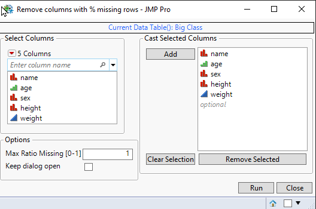

# Delete Missing Value Columns
| [Description](#description) | [Usage](#usage) | [Execution](#execution) | [Possible future features](#possible-future-features) |

## Description

Tool allows user to easily delete multiple columns which have more than specified amount (threshold) of missing values.

## Usage

If user has columns selected in the datatable those will be filled into Col List Box. If no columns are selected all columns will be added by default. 

### GUI


### Settings

| Setting           | Description                                                     | Values |
| ----------------- | --------------------------------------------------------------- | ------ |
| Max Ratio Missing | Allows user to select the point at which column will be deleted | [0,1]  |

## Execution
After user presses Run button the script will start checking which columns to delete. If columns are deleted when tool us ran, information about deleted columns will be printed to log. delete_cols will show list of deleted columns and vals_missing will show amount of missing values in the columns.
```
deleted_cols = {"name"};
vals_missing = [0.85];
```

### Running without GUI
Tool can also be run without GUI. This can be done by modifying *settings.json's* **use_gui** value to 0. In this case the tool will perform analysis on selected columns OR all columns if none are selected. The default values which will be used for **delete_threshold** will be taken from *settings.json*.

## Possible future features
* Change calculation to use only matrix operations to possible speed it up