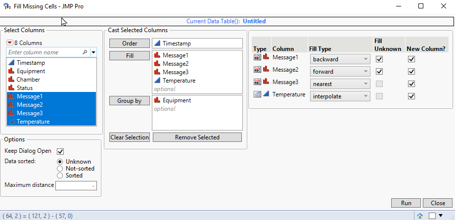
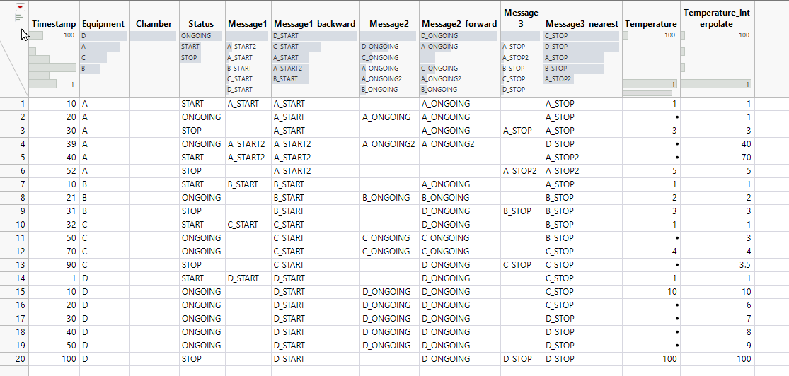

# Fill Missing Cells

Purpose is to fill missing cells based on previous/next/closest value or in case of continuous values interpolate can be used. When using closest user can also opt to use smaller or larger value as tie-breaker.

Filling can also be done over grouping columns. 

## 1. Startup

## 2. Result

 

## Options

| Option           | Description                                                                  | Value                       |
| ---------------- | ---------------------------------------------------------------------------- | --------------------------- |
| Keep dialog open | Keeps dialog open if checked after run is pressed                            | 0,1                         |
| Data sorted      | Possibility to choose if it is know that data is sorted. Makes script faster | Unknown, Not-sorted, Sorted |
| Maximum Distance | Maximum distance of values which will still be considered                    | Missing (.) or numeric      |

## Table Box options
### Fill-type
| Type             | Description                                                                         |
| ---------------- | ----------------------------------------------------------------------------------- |
| backward         | Looks for last found value before missing value                                     |
| forward          | Looks of first value after missing value                                            |
| nearest          | Looks for nearest found value                                                       |
| nearest-backward | Looks for two closest values and if the distances are tied, uses value found before |
| nearest-forward  | Looks for two closest values and if the distances are tied, uses value found after  |
| interpolate      | Uses JMP's Interpolate() function                                                   |

### Fill Unknown
Can be used with backward and forward fills. Copies latest values to missing cells which have no found value from the found values

### New Column?
Creates new column with Fill Type prefixed to name