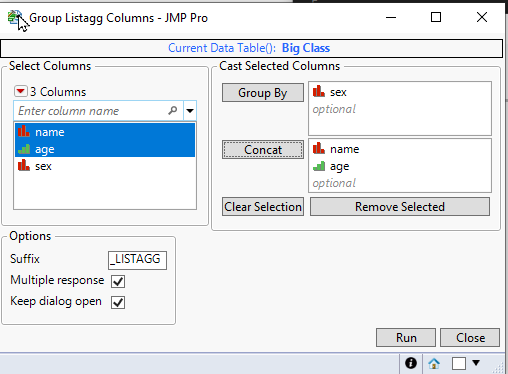
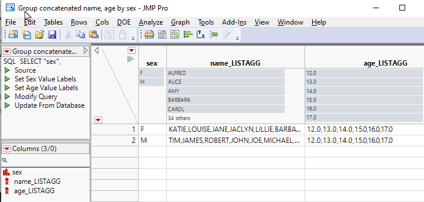

# Group Listagg Columns

| [Description](#description) | [Usage](#usage) | [Execution](#execution) | [Possible future features](#possible-future-features) |

## Description 

Tool to concatenate values over multiple rows when grouping. Can be used with fairly easily while using Summary() or Split table platforms.

## Usage
Fill columns you want to group by and the columns you want to group (concatentate/listagg over) to correct columns and press run.

## GUI

## Result

## Options
* Suffix
  * Suffix which will be added to columns
* Multiple response
  * Used to determine if new columns should have multiple response Modeling Type

## Execution
N/A

## Possible future features
* Combine with Summary and Join platforms