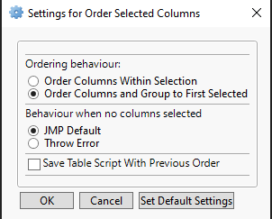

# Order Selected Columns
| [Description](#description) | [Todo](#todo) | [License](#license) |

## Description

Most of the column ordering options found from *JMP's Cols/Reorder Columns* -menu do not offer possibility to order only selected columns. The idea of this addin is to provide those options to JMP users. Idea for addin came from [JMP Community Wish List Item](https://community.jmp.com/t5/JMP-Wish-List/Column-reorder-gt-Sort-by-Name-Data-Type-Role-gt-SELECTED/idc-p/451020). 

Currently the sorting options provided are:
* Order Selected Columns by Name
* Order Selected Columns by Data Type
* Order Selected Columns by Modeling Type
* Reverse Selected Columns

After the addin has been installed new **submenu** will be added to **Add-Ins** menu:


The addin does provide couple of options user can change through **Change Settings**



Addin also provides simple access to this document by using JMP's Web() command through **Open README** button.

Currently the Add-In has been built with [Add-In-Manager @ Justin_Chilton](https://community.jmp.com/t5/JMP-Add-Ins/Add-In-Manager/ta-p/43736)

### Ordering behaviour
With this option user can select if the columns should be only sorted within the column selection, or if the columns be sorted and then moved next to first selected column (default behaviour). 

### Behaviour when no columns selected
With this option user can decide if the addin should uses JMP's default sorting options if no columns are seleced (default behaviour) or throw an error when no colums are selected:


### Save table script
With this option enabled table script will be saved to datatable which can then return the order of columns before the sorting was ran (defaults to on).

Table scripts are named based on the sorting user did:
*Return Column order before sorting by Name* for example and after running the table script following is printed to log (timestamp is in JMP's datetime format):
```javascript
"Returned column order saved at " || "3725088824" = "Returned column order saved at 3725088824";
```

## Todo
* Refactor code to be cleaner
* Add options to menu, when user right clicks on seleced column headers
  * Not sure where this should be done, also I think this cannot be yet done with Add-In manager so will require custom modification to jmpcust file
* More sorting options (all JMP offers)
* Add Toolbar
* Better management for previous column orders
  * Possibly combine with [Save Current Column Order and Grouping @ nickholmes13](https://community.jmp.com/t5/JMP-Add-Ins/Save-Current-Column-Order-and-Grouping/ta-p/394251)
  * Or change behaviour of addin and create table/list of all column changes done by the addin which then can be used to return to specific timepoint
  
## License
[MIT](../LICENSE)